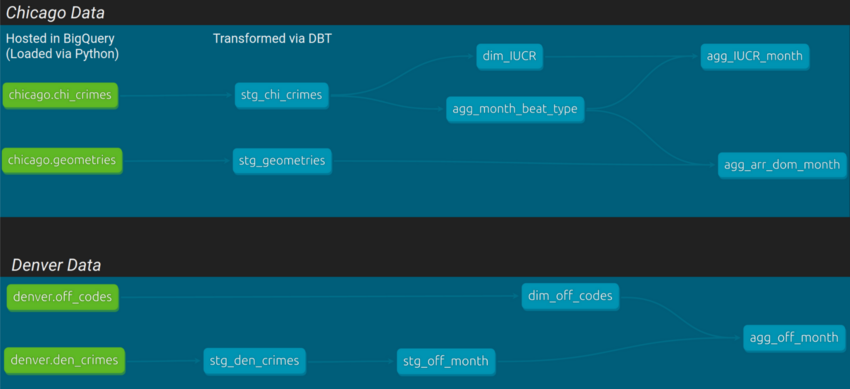

# _city-crime_ 

#### By Alejandro Socarras

<!-- ###  _Exploring Crime in Major US Cities_ -->

### Basic ELT pipeline using city crime data from Kaggle

_This repo contains and builds off my work for a [team project](https://github.com/apsocarras/team-week2) at [Epicodus](https://www.epicodus.com/)_. 

  ### [Dashboard](https://datastudio.google.com/reporting/d14cea99-515b-40f4-a3da-bb06626ad1ad)




### Datasets Used

[Crimes in Chicago](https://www.kaggle.com/datasets/onlyrohit/crimes-in-chicago) (only using years 2018-2022)

[Chicago PD Police Beats](https://data.cityofchicago.org/Public-Safety/Boundaries-Police-Beats-current-/aerh-rz74) (GeoJSON)

[Denver crime data](https://www.kaggle.com/datasets/paultimothymooney/denver-crime-data)


### Technologies Used

* Python
* SQL
* BigQuery
* DBT
* Looker Studio

### Setup/Installation
The Looker studio dashboard created from this pipeline is publicly accessible [here](https://datastudio.google.com/reporting/d14cea99-515b-40f4-a3da-bb06626ad1ad).
To run the files in this repo yourself, first create a GCP project and two BigQuery datasets (schemas) called `chicago` and `denver`. Be sure to create a service account with a credential file for the project. 

Download the datasets to the appropriate subdirectories (`./data/chicago/` and `./data/denver/`).

Then run the following commands: 

```bash
# Make a new directory for your project 
mkdir <new-directory>
cd <new-directory>

# Clone the repo  
git clone https://github.com/apsocarras/city-crime.git

# Setup virtual environment (made with python3.7)
virtualenv -p python3.7 venv 
source venv/bin/activate

# Install required packages 
pip install -r requirements.txt
```
Lastly, add the following block to your `.dbt/profiles.yml` file in your home directory: 
```yaml
city_dbt:
  outputs:
    chicago:
      dataset: chicago
      job_execution_timeout_seconds: 300
      job_retries: 1
      keyfile: </path/to/your/google/credential/file>
      location: US
      method: service-account
      priority: interactive
      project: <name-of-your-gcp-project>
      threads: 10
      type: bigquery
    denver:
      dataset: denver
      job_execution_timeout_seconds: 300
      job_retries: 1
      keyfile: </path/to/your/google/credential/file>
      location: US
      method: service-account
      priority: interactive
      project: <name-of-your-gcp-project>
      threads: 10
      type: bigquery
  target: chicago
```

## Known Bugs

_No known bugs._

## License

_[MIT License](https://opensource.org/licenses/MIT)_

Copyright (c) _2023_ Alejandro Socarras

Permission is hereby granted, free of charge, to any person obtaining a copy of this software and associated documentation files (the "Software"), to deal in the Software without restriction, including without limitation the rights to use, copy, modify, merge, publish, distribute, sublicense, and/or sell copies of the Software, and to permit persons to whom the Software is furnished to do so, subject to the following conditions:

The above copyright notice and this permission notice shall be included in all copies or substantial portions of the Software.

THE SOFTWARE IS PROVIDED "AS IS", WITHOUT WARRANTY OF ANY KIND, EXPRESS OR IMPLIED, INCLUDING BUT NOT LIMITED TO THE WARRANTIES OF MERCHANTABILITY, FITNESS FOR A PARTICULAR PURPOSE AND NONINFRINGEMENT. IN NO EVENT SHALL THE AUTHORS OR COPYRIGHT HOLDERS BE LIABLE FOR ANY CLAIM, DAMAGES OR OTHER LIABILITY, WHETHER IN AN ACTION OF CONTRACT, TORT OR OTHERWISE, ARISING FROM, OUT OF OR IN CONNECTION WITH THE SOFTWARE OR THE USE OR OTHER DEALINGS IN THE SOFTWARE.


